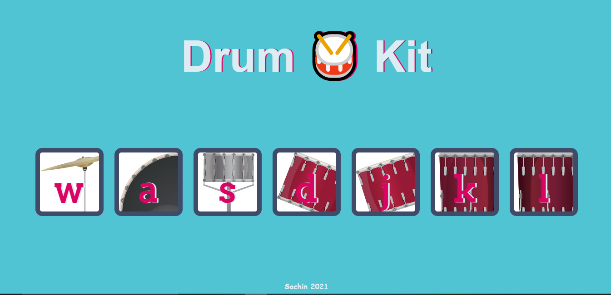

# Full Stack Developement -> Drum kit WebTool

In this project, Drum Kit web tool is created by using HTML, CSS & Javascript

Sounds corresponding to the instruments will be played based on the mouse clicks and as well as with keyboard strokes with that corresponding letters.

